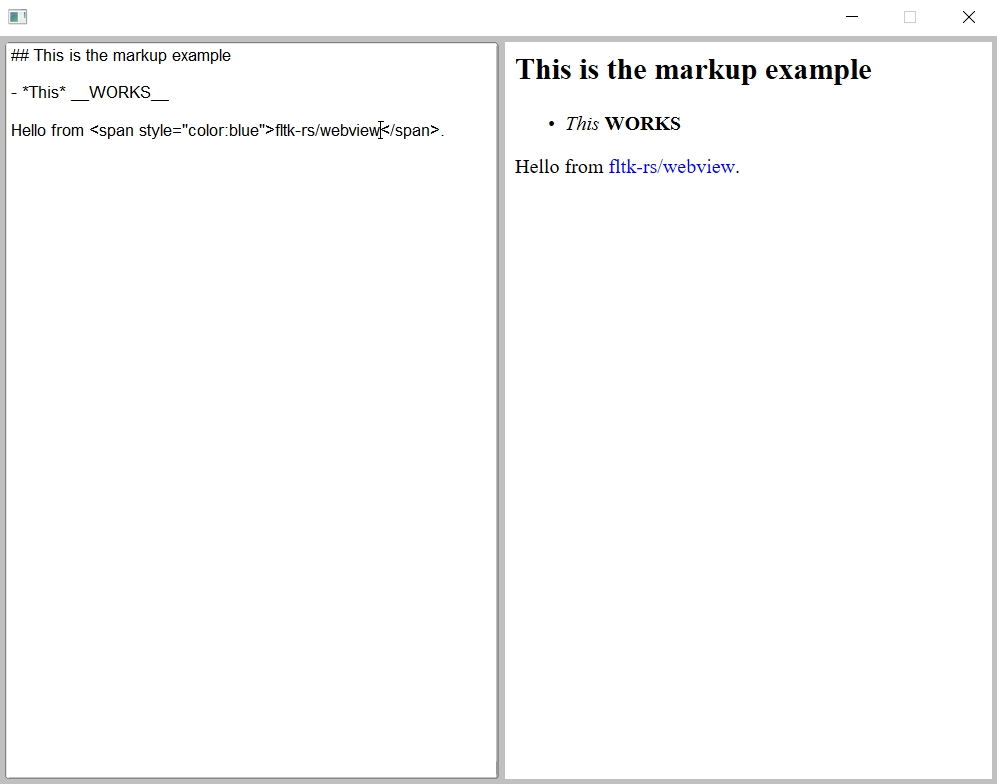

# fltk-webview

This provides webview functionality for embedded fltk windows:

## Usage
Add fltk-webview to your fltk application's Cargo.toml file:
```toml
[dependencies]
fltk = "1"
fltk-webview = "0.3" # version 0.3 hasn't been released yet
```

Then you can embed a webview using fltk_webview::Webview::create:
```rust
use fltk::{app, prelude::*, window};

fn main() {
    let app = app::App::default();
    let mut win = window::Window::default()
        .with_size(800, 600)
        .with_label("Webview");
    let mut wv_win = window::Window::default()
        .with_size(790, 590)
        .center_of_parent();
    win.end();
    win.make_resizable(true);
    win.show();

    let mut wv = fltk_webview::Webview::create(false, &mut wv_win);
    wv.navigate("https://google.com");
    
    // for version 0.2, use wv.run();
    app.run().unwrap();
}
```
P.S. Note that this example examples is for version 0.3, for version 0.2, use `wv.run();` to let webview run the event loop.

## Dependencies
- fltk-rs's dependencies, which can be found [here](https://github.com/fltk-rs/fltk-rs#dependencies).
- On Windows: The necessary shared libraries are automatically provided by the webview-official-sys crate.
- On MacOS: No dependencies.
- On X11/wayland platforms, webkit2gtk:
    - Debian-based distros: `sudo apt-get install libwebkit2gtk-4.0-dev`.
    - RHEL-based distros: `sudo dnf install webkit2gtk3-devel`.

## Known Issues
- On windows, webview requires winrt headers, that means it's currently buildable with the MSVC toolchain. For Msys2/mingw, there are efforts to provide such headers, but nothing yet upstream.
- On X11/wayland platforms:
    - need help with Gnome's mutter window manager fighting for ownership of the webview window!
    - If running with wayland, you need to pass the GDK_BACKEND=x11 environment variable for webkit2gtk to work properly.
    - KDE Plasma on X11 seems to work fine.



